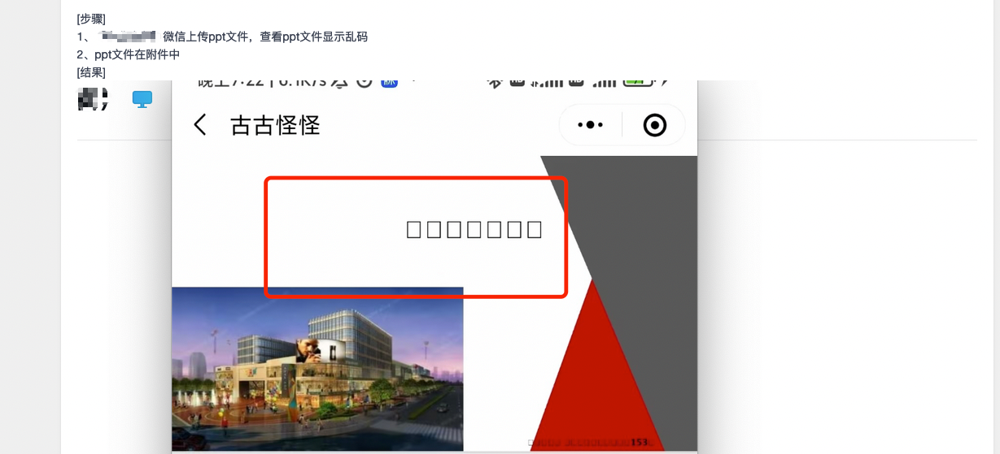
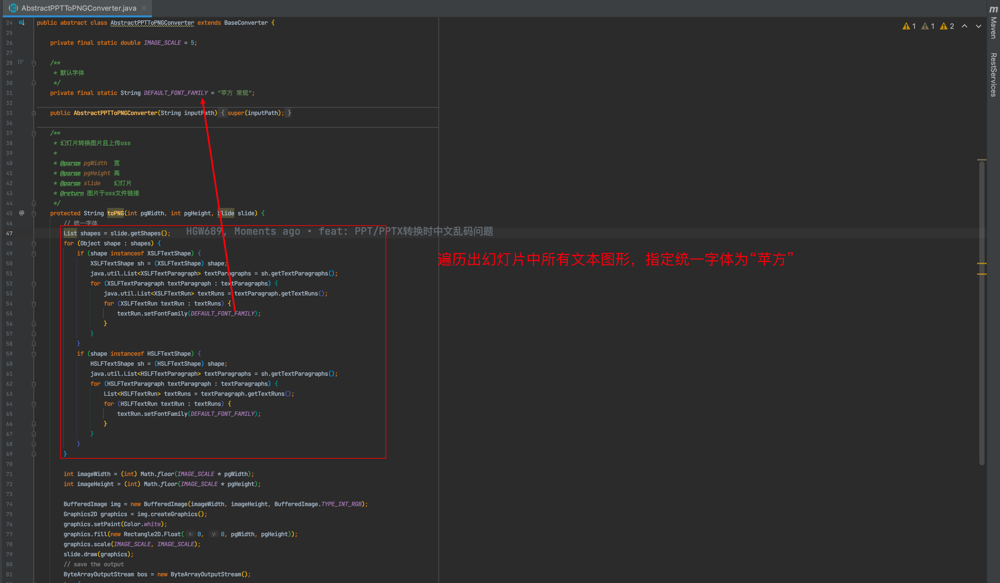
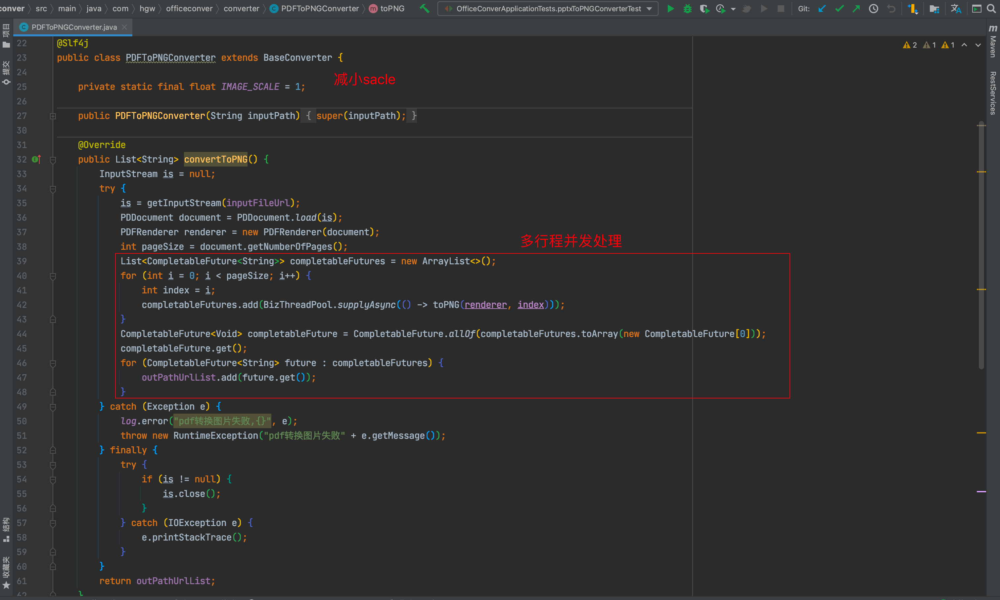
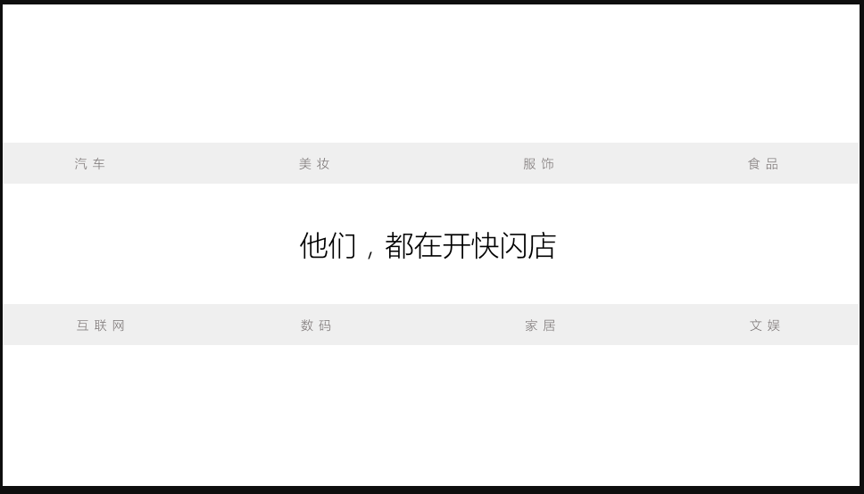
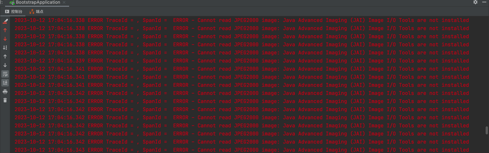
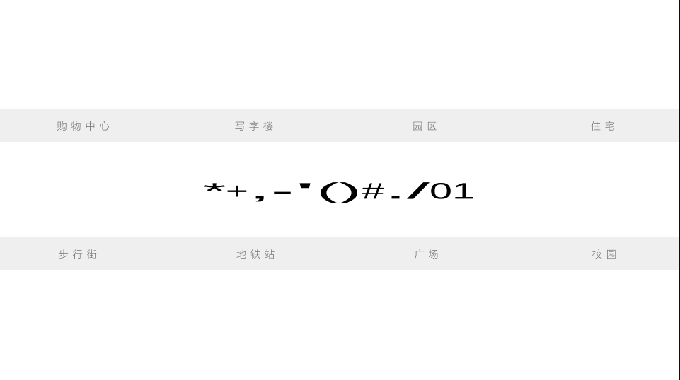
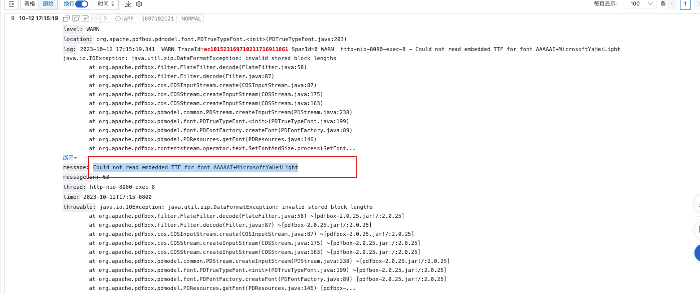

最近遇到了一个需求，需要在前端小程序中嵌入展示Office文件的功能。然而，前端使用开源组件进行在线预览会导致性能消耗较大的问题（转半天圈圈）。产品理想的效果是用户上传Office文件后，浏览起来与页面一样流畅。

>没错，作为服务端的老铁，可以提供更强大的计算资源和处理能力来支持前端小伙伴实现需求（We are a team🏠）！

这种情况下，可以在服务端使用开源插件对文件进行预览切片，将文件的预览效果保持为一张一张的图片，用户预览时直接加载图片即可。此方法带来的另一个好处是可以做懒加载和缓存功能，预览过的文件图片可以缓存，再次预览的时候可以快速加载，无需消耗流量！

**心急铁铁**，可直接拉下项目使用：[office-conver](https://gitee.com/hgw689/office-conver)

# PDF转图片

Apache PDFBox是一个功能丰富而强大的PDF处理库，提供了广泛的功能和工具来处理和操作PDF文档。它是一个开源项目，具有广泛的社区支持和活跃的开发。你可以在[Apache PDFBox的官方网站](https://pdfbox.apache.org/)上找到更多的文档、示例和API参考，以帮助你使用和了解该库的更多功能。

## 1. 万事第一步

```xml
 <dependency>
     <groupId>org.apache.pdfbox</groupId>
     <artifactId>pdfbox</artifactId>
     <version>${pdfbox.version}</version>
 </dependency>
```

## 2. 撸代码

```java
/**
 * Description: pdf转换为图片转换器
 *
 * @author YanAn
 * @date 2023/9/20 14:11
 */
@Slf4j
public class PDFToPNGConverter extends BaseConverter {

    private static final float IMAGE_SCALE = 8;

    public PDFToPNGConverter(String inputPath) {
        super(inputPath);
    }

    @Override
    public List<String> convertToPNG() {
        InputStream is = null;
        try {
            is = getInputStream(inputFileUrl);
            PDDocument document = PDDocument.load(is);
            PDFRenderer renderer = new PDFRenderer(document);
            int pageSize = document.getNumberOfPages();
            for (int i = 0; i < pageSize; i++) {
                BufferedImage img = renderer.renderImage(i, IMAGE_SCALE);
                // save the output
                try (ByteArrayOutputStream bos = new ByteArrayOutputStream()) {
                    javax.imageio.ImageIO.write(img, "png", bos);
                    String url = uploadFileToOss(bos);
                    outPathUrlList.add(url);
                }
            }
        } catch (Exception e) {
            log.error("pdf转换图片失败,{}", e.getMessage());
            throw new RuntimeException("pdf转换图片失败" + e.getMessage());
        } finally {
            try {
                if (is != null) {
                    is.close();
                }
            } catch (IOException e) {
                e.printStackTrace();
            }
        }
        return outPathUrlList;
    }

}
```

# PPT/PPTX转图片

[Apache POI](https://poi.apache.org/)（Poor Obfuscation Implementation）是一个开源的Java库，用于处理和操作Microsoft Office格式的文件，包括Word文档（.doc和.docx）、Excel电子表格（.xls和.xlsx）、PowerPoint演示文稿（.ppt和.pptx）等。它提供了丰富的API和功能，使开发人员能够读取、创建和修改Office文件。小编的另外一篇基于poi实现ppt的骚操作博文[如何使用POI读取模板PPT填充数据并拼接至目标文件](https://blog.csdn.net/m0_49183244/article/details/130109694)

## 1. 万事第一步

```xml
<dependency>
    <groupId>org.apache.poi</groupId>
    <artifactId>poi</artifactId>
    <version>4.1.2</version>
</dependency>
<dependency>
    <groupId>org.apache.poi</groupId>
    <artifactId>poi-ooxml</artifactId>
    <version>4.1.2</version>
</dependency>
<dependency>
    <groupId>org.apache.poi</groupId>
    <artifactId>poi-scratchpad</artifactId>
    <version>4.1.2</version>
</dependency>
```

## 2. 撸代码

>抽象ppt转换为图片转换器

```java
/**
 * Description: 抽象ppt转换为图片转换器
 *
 * @author YanAn
 * @date 2023/9/20 14:11
 */
public abstract class AbstractPPTToPNGConverter extends BaseConverter {

    private final static double IMAGE_SCALE = 8;

    public AbstractPPTToPNGConverter(String inputPath) {
        super(inputPath);
    }

    /**
     * 幻灯片转换图片方法并且上传oss
     *
     * @param pgWidth  宽
     * @param pgHeight 高
     * @param slide    幻灯片
     * @return 图片于oss文件链接
     * @throws IOException
     */
    protected String toPNG(int pgWidth, int pgHeight, Slide slide) throws IOException {
        int imageWidth = (int) Math.floor(IMAGE_SCALE * pgWidth);
        int imageHeight = (int) Math.floor(IMAGE_SCALE * pgHeight);

        BufferedImage img = new BufferedImage(imageWidth, imageHeight, BufferedImage.TYPE_INT_RGB);
        Graphics2D graphics = img.createGraphics();
        graphics.setPaint(Color.white);
        graphics.fill(new Rectangle2D.Float(0, 0, pgWidth, pgHeight));
        graphics.scale(IMAGE_SCALE, IMAGE_SCALE);
        slide.draw(graphics);
        // save the output
        ByteArrayOutputStream bos = new ByteArrayOutputStream();
        try {
            bos = new ByteArrayOutputStream();
            javax.imageio.ImageIO.write(img, "png", bos);
            return uploadFileToOss(bos);
        } finally {
            bos.close();
        }
    }
}
```

> ppt转换为图片转换器

```java
/**
 * Description: ppt转换为图片转换器
 *
 * @author YanAn
 * @date 2023/9/21 13:35
 */
@Slf4j
public class PPTToPNGConverter extends AbstractPPTToPNGConverter{

    public PPTToPNGConverter(String inputPath) {
        super(inputPath);
    }

    @Override
    public List<String> convertToPNG() {
        InputStream is = null;
        HSLFSlideShow ppt = null;
        try {
            is = getInputStream(inputFileUrl);
            ppt =new HSLFSlideShow(is);
            Dimension pgSize = ppt.getPageSize();
            for (HSLFSlide slide : ppt.getSlides()) {
                String url = toPNG(pgSize.width, pgSize.height, slide);
                outPathUrlList.add(url);
            }
        } catch (IOException e) {
            log.error("ppt转换图片失败,{}", e.getMessage());
            throw new RuntimeException("ppt转换图片失败" + e.getMessage());
        } finally {
            try {
                if (is != null) {
                    is.close();
                }
            } catch (IOException e) {
                e.printStackTrace();
            }
            try {
                if (ppt != null) {
                    ppt.close();
                }
            } catch (IOException e) {
                e.printStackTrace();
            }
        }
        return outPathUrlList;
    }
}
```

>pptx转换为图片转换器

```java
/**
 * Description: pptx转换为图片转换器
 *
 * @author YanAn
 * @date 2023/9/21 13:35
 */
@Slf4j
public class PPTXToPNGConverter extends AbstractPPTToPNGConverter {

    public PPTXToPNGConverter(String inputPath) {
        super(inputPath);
    }

    @Override
    public List<String> convertToPNG() {
        InputStream is = null;
        XMLSlideShow ppt = null;
        try {
            is = getInputStream(inputFileUrl);
            ppt = new XMLSlideShow(is);
            Dimension pgSize = ppt.getPageSize();
            for (XSLFSlide slide : ppt.getSlides()) {
                String url = toPNG(pgSize.width, pgSize.height, slide);
                outPathUrlList.add(url);
            }
        } catch (IOException e) {
            log.error("pptx转换图片失败,{}", e.getMessage());
            throw new RuntimeException("pptx转换图片失败" + e.getMessage());
        } finally {
            try {
                if (is != null) {
                    is.close();
                }
            } catch (IOException e) {
                e.printStackTrace();
            }
            try {
                if (ppt != null) {
                    ppt.close();
                }
            } catch (IOException e) {
                e.printStackTrace();
            }
        }
        return outPathUrlList;
    }
}
```

## 验收一下


# 踩坑经历

> 自此office转换图片的功能基本实现，我们部署至服务器！

## 1、PPT/PPTX转换时中文乱码问题

当我们在本地测试一切ok，提测后部署到服务器之后突然收到了一个**BUG**（中文乱码，成方框`口`）!



那是因为ppt内容中字体不支持，服务器未安装中文字体，一般我们的服务器部署方案不支持做这件事（将所有的字体下载至镜像），业务代码的服务器都在 k8s 集群上，相对都是无状态的，没有什么其它额外的东西，如果将所有字体放进去整个镜像会特别大不太适合走 k8s这套了。若非要这样的话，推荐重新部署一台服务器，专门用于文件转换。当然，有条件的铁铁就不用考虑啦，直接下载所有字体！

> 如果未安装，可通过 yum -y install fontconfig 安装，然后在/usr/share 目录下会发现 fonts目录，下载中文字体如：heiti.ttf
>
> 拷贝到fonts目录下，chmod 赋权限。再次执行 fc-list :" class="has" data-src="/image/https://img-blog.csdnimg.cn/20181106180741352.png" height="54" src="/assets/images/photo.gif" width="738"/>
>
> 如果是docker环境，则可将上述安装步骤写入到dockerfile中。

**这里演示没有条件的解决方案**，下载 "苹方"字体，并在PPT/PPT转换文件时统一字体为 "苹方"（当然可以是其他字体，如“宋体”……）

第一步、下载字体


第二步、编写dockerfile安装字体

```
#PDF 转图片中文乱码#
RUN set -xe \
&& apk --no-cache add fontconfig
#&& apk --no-cache add ttf-dejavu fontconfig
COPY pingfang.ttf /usr/share/fonts/ttf-dejavu/pingfang.ttf
#PDF 转图片中文乱码#
```

第三步、转换器中指定字体




## 2、OOM问题

由于转换是ppt的每一页进行单独转换，如果ppt页数多，可能会慢。 解决办法，一种是减小上文中的image_rate，如设置为1。还有就是可以通过多线程并发转换，但是由于该转换操作是CPU密集型操作，所以需要根据机器性能决定。具体代码如下：

**文件转换器专用线程工具类**：

> 根据机器性能线程池配置如下（大家根据自己的服务器自行调**前三项**）：
>
> + 核心线程池大小：5
> + 最大线程池大小：5
> + 阻塞工作队列：2
> + 拒绝策略：调用方执行（此处核心，请勿改动！当然有条件的除外）
>
> 因为本文主要是讲解office文件转换至图片，关于线程池的相关知识这里不做解释，给大家推荐一本书《Java并发编程的艺术》

```java
package com.hgw.officeconver.thread;

import lombok.extern.slf4j.Slf4j;

import java.util.concurrent.CompletableFuture;
import java.util.concurrent.LinkedBlockingQueue;
import java.util.concurrent.ThreadPoolExecutor;
import java.util.concurrent.TimeUnit;
import java.util.function.Supplier;

/**
 * Description: 文件转换器专用线程工具
 *
 * @author LinHuiBa-YanAn
 * @date 2023/10/10 16:23
 */
@Slf4j
public class BizThreadPool {

    private static ThreadPoolExecutor threadPoolExecutor = new ThreadPoolExecutor(5, 5, 2, TimeUnit.SECONDS, new LinkedBlockingQueue<>(1), new ThreadPoolExecutor.CallerRunsPolicy());


    /**
     * 线程执行（有返回值）
     *
     * @param supplier
     * @param <T>
     * @return
     */
    public static <T> CompletableFuture<T> supplyAsync(Supplier<T> supplier) {
        return CompletableFuture.supplyAsync(() -> {
            try {
                return supplier.get();
            } catch (Exception e) {
                log.warn("异步执行错误", e);
                throw e;
            }
        }, threadPoolExecutor);
    }

}
```

以PDF转换代码为例：




## 3、Cannot read JPEG2000 image: Java Advanced Imaging (JAI) Image I/O Tools are not installed 问题解决

我们发现pdf中包含JPEG2000格式的图片时，图片将渲染不出来。

pdf效果


转换后：




通过查看日志发现以下报错。



原因是不能读取JPEG2000格式的图片，需要引入以下工具。

~~~xml
  <dependency>
      <groupId>com.github.jai-imageio</groupId>
      <artifactId>jai-imageio-core</artifactId>
      <version>1.4.0</version>
  </dependency>
  <dependency>
      <groupId>com.github.jai-imageio</groupId>
      <artifactId>jai-imageio-jpeg2000</artifactId>
      <version>1.3.0</version>
  </dependency>
  <dependency>
      <groupId>org.apache.pdfbox</groupId>
      <artifactId>jbig2-imageio</artifactId>
      <version>3.0.3</version>
  </dependency>
~~~


## 4、Could not read embedded TTF for font AAAAAI+MicrosoftYaHeiLight 问题处理

我们发现pdf中包含一些特殊字体时，解析之后将会是一串编码。

pdf效果：


转换后：



通过查看日志发现以下报错。



引入以下包：

```xml
<dependency>
    <groupId>com.itextpdf</groupId>
    <artifactId>itextpdf</artifactId>
    <version>5.5.10</version>
</dependency>
```
