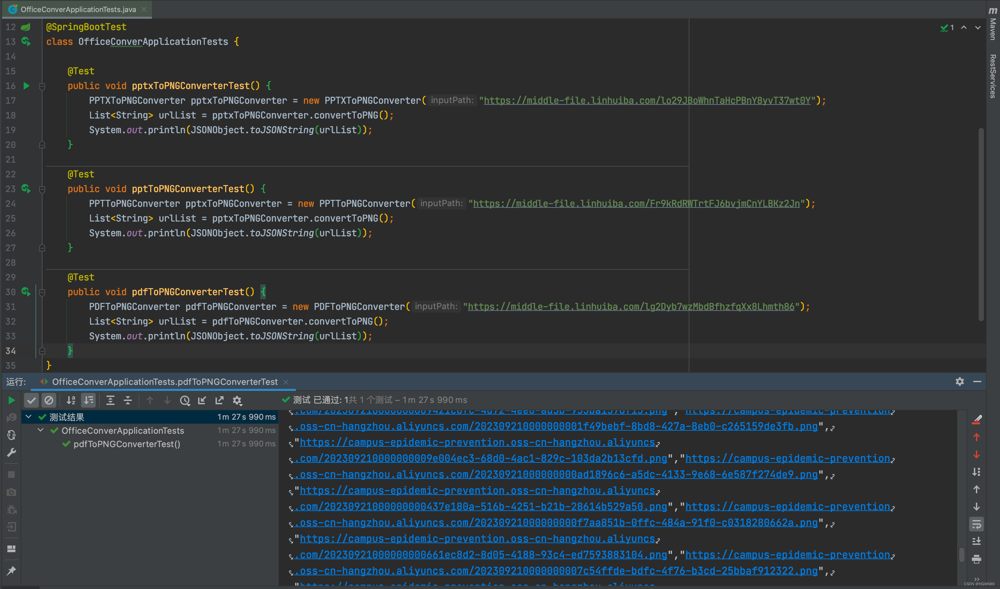

最近遇到了一个需求，需要在前端小程序中嵌入展示Office文件的功能。然而，前端使用开源组件进行在线预览会导致性能消耗较大的问题（转半天圈圈）。产品理想的效果是用户上传Office文件后，浏览起来与页面一样流畅。

>没错，作为服务端的老铁，可以提供更强大的计算资源和处理能力来支持前端小伙伴实现需求（We are a team🏠）！

这种情况下，可以在服务端使用开源插件对文件进行预览切片，将文件的预览效果保持为一张一张的图片，用户预览时直接夹在图片即可。此方法带来的另一个好处是可以做懒加载和缓存功能，预览过的文件图片可以缓存，再次预览的时候可以快速加载，无需消耗流量！

**心急铁铁**，可直接拉下项目使用：[office-conver](https://gitee.com/hgw689/office-conver)

# PDF转图片

Apache PDFBox是一个功能丰富而强大的PDF处理库，提供了广泛的功能和工具来处理和操作PDF文档。它是一个开源项目，具有广泛的社区支持和活跃的开发。你可以在[Apache PDFBox的官方网站](https://pdfbox.apache.org/)上找到更多的文档、示例和API参考，以帮助你使用和了解该库的更多功能。

## 1. 万事第一步

```xml
 <dependency>
     <groupId>org.apache.pdfbox</groupId>
     <artifactId>pdfbox</artifactId>
     <version>${pdfbox.version}</version>
 </dependency>
```

## 2. 撸代码

```java
/**
 * Description: pdf转换为图片转换器
 *
 * @author YanAn
 * @date 2023/9/20 14:11
 */
@Slf4j
public class PDFToPNGConverter extends BaseConverter {

    private static final float IMAGE_SCALE = 8;

    public PDFToPNGConverter(String inputPath) {
        super(inputPath);
    }

    @Override
    public List<String> convertToPNG() {
        InputStream is = null;
        try {
            is = getInputStream(inputFileUrl);
            PDDocument document = PDDocument.load(is);
            PDFRenderer renderer = new PDFRenderer(document);
            int pageSize = document.getNumberOfPages();
            for (int i = 0; i < pageSize; i++) {
                BufferedImage img = renderer.renderImage(i, IMAGE_SCALE);
                // save the output
                try (ByteArrayOutputStream bos = new ByteArrayOutputStream()) {
                    javax.imageio.ImageIO.write(img, "png", bos);
                    String url = uploadFileToOss(bos);
                    outPathUrlList.add(url);
                }
            }
        } catch (Exception e) {
            log.error("pdf转换图片失败,{}", e.getMessage());
            throw new RuntimeException("pdf转换图片失败" + e.getMessage());
        } finally {
            try {
                if (is != null) {
                    is.close();
                }
            } catch (IOException e) {
                e.printStackTrace();
            }
        }
        return outPathUrlList;
    }

}
```

# PPT/PPTX转图片

[Apache POI](https://poi.apache.org/)（Poor Obfuscation Implementation）是一个开源的Java库，用于处理和操作Microsoft Office格式的文件，包括Word文档（.doc和.docx）、Excel电子表格（.xls和.xlsx）、PowerPoint演示文稿（.ppt和.pptx）等。它提供了丰富的API和功能，使开发人员能够读取、创建和修改Office文件。小编的另外一篇基于poi实现ppt的骚操作博文[如何使用POI读取模板PPT填充数据并拼接至目标文件](https://blog.csdn.net/m0_49183244/article/details/130109694)

## 1. 万事第一步

```xml
<dependency>
    <groupId>org.apache.poi</groupId>
    <artifactId>poi</artifactId>
    <version>4.1.2</version>
</dependency>
<dependency>
    <groupId>org.apache.poi</groupId>
    <artifactId>poi-ooxml</artifactId>
    <version>4.1.2</version>
</dependency>
<dependency>
    <groupId>org.apache.poi</groupId>
    <artifactId>poi-scratchpad</artifactId>
    <version>4.1.2</version>
</dependency>
```

## 2. 撸代码

>抽象ppt转换为图片转换器

```java
/**
 * Description: 抽象ppt转换为图片转换器
 *
 * @author YanAn
 * @date 2023/9/20 14:11
 */
public abstract class AbstractPPTToPNGConverter extends BaseConverter {

    private final static double IMAGE_SCALE = 8;

    public AbstractPPTToPNGConverter(String inputPath) {
        super(inputPath);
    }

    /**
     * 幻灯片转换图片方法并且上传oss
     *
     * @param pgWidth  宽
     * @param pgHeight 高
     * @param slide    幻灯片
     * @return 图片于oss文件链接
     * @throws IOException
     */
    protected String toPNG(int pgWidth, int pgHeight, Slide slide) throws IOException {
        int imageWidth = (int) Math.floor(IMAGE_SCALE * pgWidth);
        int imageHeight = (int) Math.floor(IMAGE_SCALE * pgHeight);

        BufferedImage img = new BufferedImage(imageWidth, imageHeight, BufferedImage.TYPE_INT_RGB);
        Graphics2D graphics = img.createGraphics();
        graphics.setPaint(Color.white);
        graphics.fill(new Rectangle2D.Float(0, 0, pgWidth, pgHeight));
        graphics.scale(IMAGE_SCALE, IMAGE_SCALE);
        slide.draw(graphics);
        // save the output
        ByteArrayOutputStream bos = new ByteArrayOutputStream();
        try {
            bos = new ByteArrayOutputStream();
            javax.imageio.ImageIO.write(img, "png", bos);
            return uploadFileToOss(bos);
        } finally {
            bos.close();
        }
    }
}
```

> ppt转换为图片转换器

```java
/**
 * Description: ppt转换为图片转换器
 *
 * @author YanAn
 * @date 2023/9/21 13:35
 */
@Slf4j
public class PPTToPNGConverter extends AbstractPPTToPNGConverter{

    public PPTToPNGConverter(String inputPath) {
        super(inputPath);
    }

    @Override
    public List<String> convertToPNG() {
        InputStream is = null;
        HSLFSlideShow ppt = null;
        try {
            is = getInputStream(inputFileUrl);
            ppt =new HSLFSlideShow(is);
            Dimension pgSize = ppt.getPageSize();
            for (HSLFSlide slide : ppt.getSlides()) {
                String url = toPNG(pgSize.width, pgSize.height, slide);
                outPathUrlList.add(url);
            }
        } catch (IOException e) {
            log.error("ppt转换图片失败,{}", e.getMessage());
            throw new RuntimeException("ppt转换图片失败" + e.getMessage());
        } finally {
            try {
                if (is != null) {
                    is.close();
                }
            } catch (IOException e) {
                e.printStackTrace();
            }
            try {
                if (ppt != null) {
                    ppt.close();
                }
            } catch (IOException e) {
                e.printStackTrace();
            }
        }
        return outPathUrlList;
    }
}
```

>pptx转换为图片转换器

```java
/**
 * Description: pptx转换为图片转换器
 *
 * @author YanAn
 * @date 2023/9/21 13:35
 */
@Slf4j
public class PPTXToPNGConverter extends AbstractPPTToPNGConverter {

    public PPTXToPNGConverter(String inputPath) {
        super(inputPath);
    }

    @Override
    public List<String> convertToPNG() {
        InputStream is = null;
        XMLSlideShow ppt = null;
        try {
            is = getInputStream(inputFileUrl);
            ppt = new XMLSlideShow(is);
            Dimension pgSize = ppt.getPageSize();
            for (XSLFSlide slide : ppt.getSlides()) {
                String url = toPNG(pgSize.width, pgSize.height, slide);
                outPathUrlList.add(url);
            }
        } catch (IOException e) {
            log.error("pptx转换图片失败,{}", e.getMessage());
            throw new RuntimeException("pptx转换图片失败" + e.getMessage());
        } finally {
            try {
                if (is != null) {
                    is.close();
                }
            } catch (IOException e) {
                e.printStackTrace();
            }
            try {
                if (ppt != null) {
                    ppt.close();
                }
            } catch (IOException e) {
                e.printStackTrace();
            }
        }
        return outPathUrlList;
    }
}
```

## 验收一下

